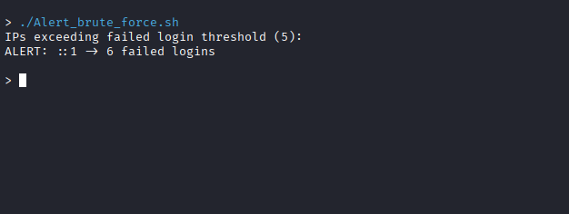
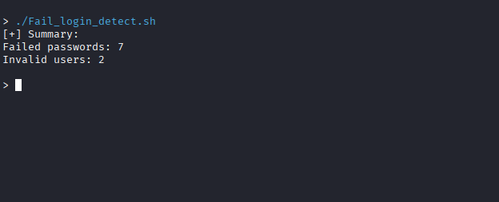
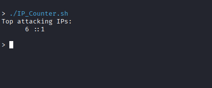
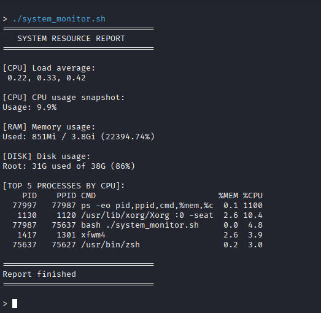
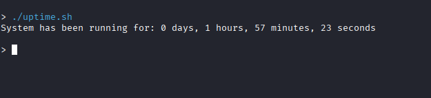

## Scripts

### alert_brute_force.sh

Detects IP addresses exceeding a configurable threshold of failed SSH login attempts.

**Features**

* Reads authentication events from `journalctl`
* Counts failed SSH login attempts
* Identifies source IP addresses
* Configurable alert threshold



---

### fail_login_detect.sh

Displays a summary of authentication failures.

**Features**

* Counts failed password attempts
* Counts invalid user login attempts
* Provides a quick authentication security overview



---

### ip_counter.sh

Lists the most frequent source IP addresses found in failed SSH login attempts.

**Features**

* Reads authentication events from `journalctl`
* Extracts source IP addresses
* Counts failed login sources
* Sorts IP addresses by number of attempts



---

### system_monitor.sh

Displays a real-time system resource summary.

**Features**

* CPU usage
* Load average
* RAM usage
* Disk usage
* Top CPU-consuming processes



---

### uptime.sh

Displays the system uptime in a human-readable format.

**Features**

* Days
* Hours
* Minutes
* Seconds



## Usage

```bash
chmod +x *.sh

./alert_brute_force.sh

./fail_login_detect.sh

./ip_counter.sh

./system_monitor.sh

./uptime.sh
```
